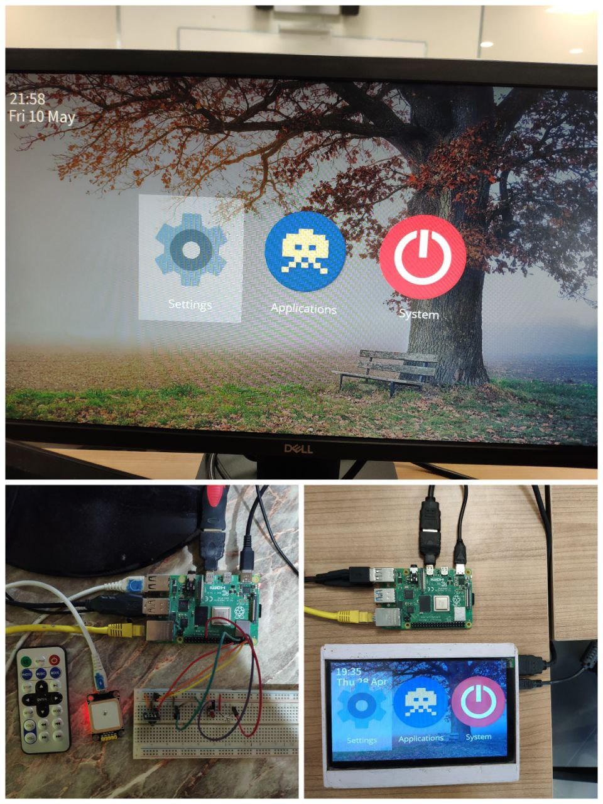

# Infotainment System

This project's repo. is for **NTI Embedded Linux Graduation Project**.

This is a project to create an infotainment system, infotainment system is a mash-up of _"information"_ and _"entertainment"_ and it refers to the sleek display (or displays) that you'll find in most modern cars' dashboards. It typically includes radio, media players, navigation systems, Bluetooth connectivity, WiFi hot-spots, smartphone integration, voice controls, rear seat entertainment screens, climate control, and a variety of other features.

:bulb: **This infotainment system project _(Sudo Team)_ is designed to be generic across all of Embedded Linux Devices, for example infotainment, TVs, IoT devices, or POS.**



## Table of Contents

- [Infotainment System](#infotainment-system)
  - [Table of Contents](#table-of-contents)
  - [Description](#description)
  - [Technologies](#technologies)
  - [Features](#features)
  - [Steps to run the project](#steps-to-run-the-project)
    - [Steps](#steps)
  - [Contributors](#contributors)
  - [Demo](#demo)
  - [References](#references)

## Description

The infotainment system is a project that aims to create a generic infotainment system that can be used in any embedded Linux device. The system will be designed to be modular and extensible, allowing developers to easily add new features and functionality.

The system is based on **`Weston-Linux` distribution** integrated with **custom application built with `Qt Framework`** _(informative app and car status)_ and **open source applications such as `media player`** _(mpv)_. **Connected with the internet** it utilize integrated sensors _(temperature sensor and GPS)_ to publish its state to **`IoT` platform** _(node-red)_.

It is integrated with a **home screen `launcher` application** to list all of the application. This system can be controlled via **`IR remote`**.

---

## Technologies

- **Weston _(Wayland Compositor)_** - Weston is the reference implementation of a Wayland compositor, which is a key element in the **graphical environment** of the system.
- **Yocto Project** - Yocto Project, a comprehensive suite of tools, templates, and resources to build custom Linux distributions for embedded devices.
- **Qt Framework** - Qt is a cross-platform application framework that is widely used for developing application software with a graphical user interface (GUI).
- **Connectivity** - Using **Bluetooth** to connect to devices such as smartphones and headphones and **WiFi** to connect to the internet and **GPS** to get the location of the system.
- **IoT Platform** - Using **Node-RED** is a flow-based development tool for visual programming, wiring together hardware devices, APIs, and online services as part of the Internet of Things.
- **Various Libraries** - Using various libraries to add the functionality of different features such as GPS, IR remote.

---

## Features

- **Flex-Launcher** - Home screen launcher application to list all of the applications.
- **Media Player** - Media player application to play audio and video files _(mpv)_.
- **Informative App** - Informative application to display information about the car and the system.
- **Car Status App** - Car status application to display the status of the car _(temperature, speed, etc.)_.
- **IoT Integration** - Publish the state of the system to the IoT platform in addition to taking commands from the platform _(node-red)_.
- **IR Remote** - Control the system using an IR remote.
- **Temperature Sensor** - Read the temperature of the system and display it on the informative app.
- **GPS** - Read the GPS location of the system and display it on the informative app.
- **Bluetooth** - Connect to Bluetooth devices such as smartphones and headphones which allows audio streaming.
- **WiFi** - Connect to the internet using WiFi.

> :bulb: All of these features/modules/applications are integrated using `yocto`, which by using it, a customizable image is created for the target device.

---

## Steps to run the project

Each Section contains important parts of the project:

- [Infotainment System UI](./Infotainment-System-UI/) - Contains the Qt applications _(Informative App, Car Status App)_.
- [Python Scripts](./py/) - Contains the Python scripts to read the temperature sensor, GPS and to be running in the background publishing the state of the system to the IoT platform.
- [Images](./Images/) - Contains the image of the system that is built using Yocto and comprehensive illustration of the system integration.

---
### Hardware Used
1. Raspberry Pi 4
2. Temperature Sensor DS18B20
3. GPS Module NEO-6M
4. IR Remote with IR receiver
5. SD Card
6. HDMI Display
7. Two LEDs and a Button

### Steps

1. Clone the required meta-layers:

```bash
git clone -b Kirkstone git://git.yoctoproject.org/poky.git
git clone -b Kirkstone git://git.openembedded.org/meta-openembedded
git clone -b Kirkstone git://git.yoctoproject.org/meta-raspberrypi
git clone -b 6.5 git://git.yoctoproject.org/meta-qt6
# Clone and use our meta-infotainment layer
```

2. Initialise your build environment:

```bash
source poky/oe-init-build-env ../build-infotaiment

```

3. Add the required layers to your `bblayers.conf`:

```bash
BBLAYERS ?= " \
  PATH_TO/poky/meta \
  PATH_TO/poky/meta-poky \
  PATH_TO/poky/meta-yocto-bsp \
  PATH_TO/meta-openembedded/meta-oe \
  PATH_TO/meta-openembedded/meta-python \
  PATH_TO/meta-openembedded/meta-networking \
  PATH_TO/meta-openembedded/meta-multimedia
  PATH_TO/meta-raspberrypi \
  PATH_TO/meta-infotainment \
  "
```

4. Add the required packages to your `local.conf`:

> Check the `local.conf` file in our repo [local.conf](Yocto/conf/local.conf) for the required packages.

> Please Note that you can use the custom image recipe [infotainment-image.bb](Yocto/meta-infotainment/recipes-core/images/infotainment-image.bb) and build with it instead of adding the packages to the `local.conf`. 

5. Build the image:

```bash
# If you want to build the default image with custom local.conf file
bitbake core-image-weston

# OR if you want to build with the custom image recipe
bitbake infotainment-image
```
6. Flash the image to the target device.
```bash
# 1- Go to the build/deploy/images/raspberrypi4-64 directory
# 2- decompress the image file using the following command
bzip2 -dk <the compressed wic image>

# 3- Flash the image to the SD card
sudo dd if=<the decompressed wic image> of=/dev/sdX 
```
7. Add the following to the boot/config.txt file in the SD card to enable the temperature sensor:
```bash
dtoverlay=w1-gpio
```

8. Boot the device 
---

## Contributors

- **Hosam Mohamed**
- **Ziad Asem**
- **Taqi Eldeen Moanes**
- **Ali El-Karamany**
- **Mina Zakka**

---

## Demo

[Demo Video]

---

## References

- [Wayland & Weston](https://wayland.freedesktop.org/)
- [Yocto Project](https://www.yoctoproject.org/)
